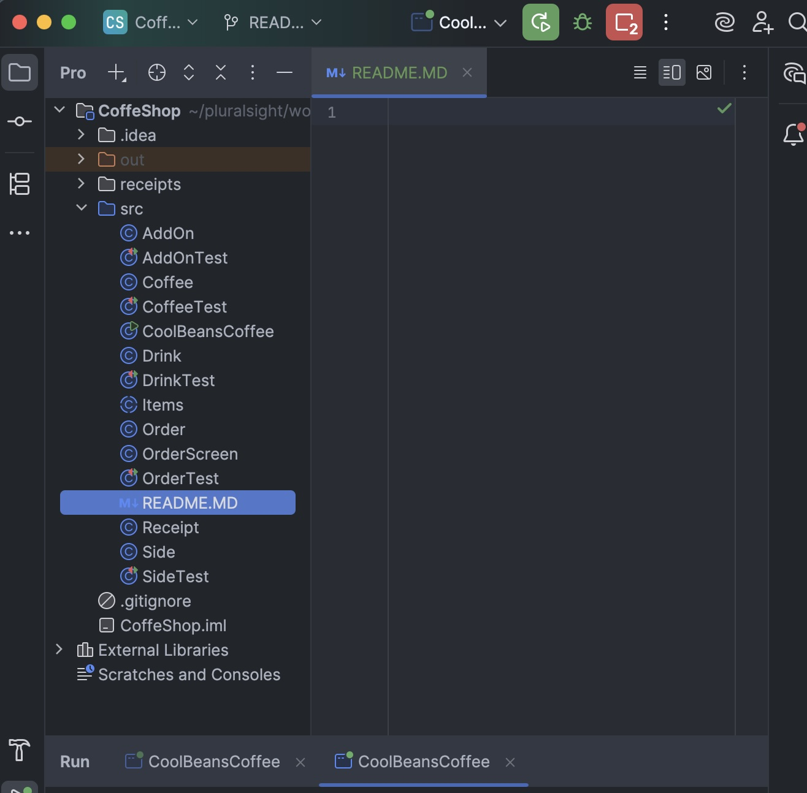
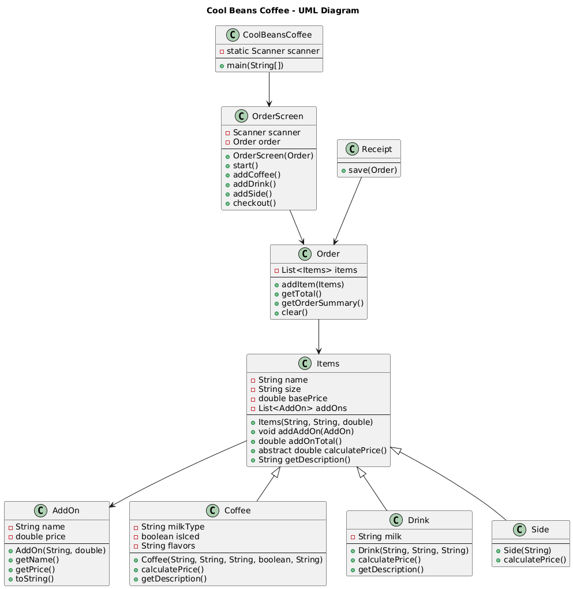

# Hello, Welcome to my CoolBeans README☕☕

# 📚 Table of Contents
### About the Project
### Features
### Getting Started
### Folder Structure
### Code Examples
### Images
### Markdown Reference
### Contributing

# About the Project

## Cool Beans main.Coffee is a Java console-based Point-of-Sale (POS) system for a custom coffee shop.

## Customize drinks

### Choose flavors and milk types

### Add pastries

### Add extra toppings

### Receive a nicely formatted printed receipt

### Have receipts automatically saved in a /receipts/ folder
# OOP Concepts Used
## Inheritance

## Used when:

### main.Coffee class

### main.Drink class

### main.Side class

# Inherited from the parent class main.Items

### main.Items is an abstract class, requiring subclasses to implement their own calculatePrice() method.

# Polymorphism

## main.Order stores:

## List<main.Items> items
## This allows main.Coffee, main.Drink, or main.Side objects to be handled the same way.

Encapsulation

Fields like:

private String name;

are hidden and accessed only through getters and methods like addAddOn().

File I/O

main.Receipt.save() writes a receipt file using:

FileWriter writer

Saved inside a /receipts folder.

Lists & Streams

Add-on totals use Streams:

addOns.stream().mapToDouble(main.AddOn::getPrice).sum();

# 🎯 Features
### ✔ main.Coffee Customization

### Size (small, medium, large)

### Milk: oat, almond, coconut, whole

# Flavors

## Iced options

## Add-ons (foam, syrup, whipped cream)

# ✔ Additional Drinks

### Matcha

### Hot Chocolate

# Optional add-ons

### ✔ Pastries

### Croissants

### Muffins

### Cookies

# ✔ main.Receipt Generation

### Automatically saved to /receipts/

### Timestamped

### Centered text formatting

## Screenshots

## UML Diagram

## My Favorite code for this cafe is 

# Conclusion 
Made by Sherman Turner-Robinson
Thanks for stopping by my shop! ☕ :)
If you have ideas to make Cool Beans main.Coffee even tastier, feel free to share.
